---

<!-- Keep existing GIF/banner -->

  

---

# 👋 I'm Olusegun Emmanuel

### Software Engineer | React • React Native • FastAPI • DevOps • Python • PostgreSQL • System Design

🇳🇬 Nigeria • 🌍 Open to Remote Opportunities

> 📩 **Currently available for full-time remote roles and contract work** — [let's connect on LinkedIn](https://www.linkedin.com/in/olusegun-omogbehinmi) or email me at olusegunemmanuel1031@gmail.com

I build full-stack products end-to-end — from FastAPI/PostgreSQL backends to React and React Native frontends — and lead a small team across web, mobile, and backend, with a strong DevOps/infrastructure lean.

---

## 🚀 Currently Building
<!--START_SECTION:building-->
_No recent commit activity found._
<!--END_SECTION:building-->

---

## 🌟 Featured Projects

<!--START_SECTION:projects-->

### [CodewithSegNet](https://github.com/CodewithSegNet/CodewithSegNet)
My Automated GitHub ReadMe profile.

**Python** · ⭐ 1

### [alx-backend-python](https://github.com/CodewithSegNet/alx-backend-python)
Type annotations in Python 3,  How you can use type annotations to specify function signatures and variable types,  Duck typing,  How to validate your code with mypy

**Python** · ⭐ 1

### [alx-higher_level_programming](https://github.com/CodewithSegNet/alx-higher_level_programming)
Write a Shell script that runs a Python script.

**Python** · ⭐ 1

### [AftA-Project](https://github.com/CodewithSegNet/AftA-Project)
Africa’s New Social Pulse From Lagos to Nairobi, connect with real people, real vibes, and real stories. AftA is the heartbeat of Africa’s online generation.

**JavaScript** · ⭐ 0

<!--END_SECTION:projects-->

---

## 🛠️ What I Build & How I Build It

**Backend Engineering**
- RESTful APIs with FastAPI, SQLAlchemy, PostgreSQL
- Authentication & Authorization (JWT, OAuth2, RBAC)
- System architecture, database design, performance tuning

**Frontend & Mobile**
- React, TypeScript, TanStack Start/Query, Vite, Tailwind CSS
- Mobile apps with React Native / Expo

**DevOps & Leadership**
- Docker, CI/CD pipelines (GitHub Actions), Linux, AWS
- Cross-product technical decisions, code reviews
- Coordinating a development team (ticketing, planning, delivery)

---

## 📈 GitHub Stats

<!-- Retro terminal stats — auto-generated by generate_stats.py -->

---

## ⏱️ WakaTime Stats
<!--START_SECTION:waka-->
<!--END_SECTION:waka-->

---

## 📅 Recent Activity
<!--START_SECTION:activity-->
<!--END_SECTION:activity-->

---

## 🛎️ Services

- ✅ Remote Frontend, Backend & DevOps Engineer (Full-Time or Contract)
- ✅ API Development & Integration
- ✅ System Architecture & Design
- ✅ Mobile App Development (React Native)
- ✅ Technical Leadership & Mentoring
- ✅ Code Reviews & Performance Optimisation
- ✅ DevOps & CI/CD Automation

---

## 📞 Get In Touch

| Channel | Link |
|---------|------|
| **LinkedIn** | [Olusegun Omogbehinmi](https://www.linkedin.com/in/olusegun-omogbehinmi) |
| **Email** | olusegunemmanuel1031@gmail.com |
| **Portfolio** | [olusegun.site](https://olusegun.site) |

---

<!-- End of README -->
